#🛡️JanusGuard

<div align="center">
  
  
  
  <br>
  <strong>Java应用运行时安全监控系统</strong>
  <p>基于Java Agent和字节码转换技术的应用安全守护方案</p>
</div>

## 📋 概述

JanusGuard是一个Java应用运行时安全监控系统，通过Java Agent技术和字节码转换实现对应用行为的监控和安全风险检测，旨在提供一种低侵入、可配置的安全防护方案。它能够监控和防御各种运行时安全威胁，包括命令注入、文件操作风险以及内存木马攻击。

## 开发团队

## 🔍 核心理念

- **📊 低侵入监控:** 最小化性能开销，对应用透明
- **🧠 智能分析:** 结合上下文和行为分析进行安全判断
- **⚙️ 动态调整:** 支持运行时调整监控范围和策略
- **🔗 事件关联:** 分析多个事件间关系以发现复杂攻击模式 
- **🧩 扩展性设计:** 支持自定义监控点和分析方法

## ✨ 功能特点

- **🔄 无代码修改:** 无需更改应用源码，直接通过JVM参数加载
- **⚡ 高效执行:** 采用轻量级探针设计和高性能队列处理
- **🔧 灵活配置:** 支持多种配置方式和策略调整
- **🚀 简便部署:** 支持启动时加载或运行时动态附加
- **🔎 全面监控:** 覆盖常见安全敏感操作点

## ✅ 已实现功能

目前版本已完成的功能：

- **🏗️ 核心框架:** 
  - Agent生命周期管理 ✓
  - 配置加载与验证 ✓
  - 组件初始化与终止 ✓

- **👁️ 监控点:** 
  - 命令执行 (`Runtime.exec`, `ProcessBuilder.start`) ✓
  - 文件操作 (`FileInputStream`, `FileOutputStream`, `RandomAccessFile`) ✓
  - 反射调用 (`Method.invoke`) ✓
  - 内存木马检测:
    - 类加载监控 (`ClassLoader.defineClass`) ✓
    - Unsafe内存操作 (`sun.misc.Unsafe`) ✓
    - 动态代理创建 (`java.lang.reflect.Proxy`) ✓
    - JNI库加载 (`System.load`, `System.loadLibrary`) ✓

- **📊 事件处理:** 
  - 事件收集与过滤 ✓
  - 异步队列处理 ✓
  - 本地存储记录 ✓
  - 内存木马行为分析与告警 ✓

- **⚙️ 配置系统:** 
  - YAML配置文件支持 ✓
  - 命令行参数设置 ✓
  - 内存木马检测配置 ✓

- **🔒 安全防护:**
  - 危险命令检测 ✓
  - 命令执行拦截 ✓
  - 多层监控机制 ✓

- **💼 应用集成:**
  - JDK 8兼容版本 ✓
  - 多种集成方式 ✓
  - 辅助工具类 ✓

## 🏛️ 架构设计



## 🚀 快速开始

### 📥 安装

从[Releases](https://github.com/your-repo/janusguard/releases)下载最新版本的JanusGuard Agent JAR文件。

### ▶️ 在应用启动时加载Agent

```bash
java -javaagent:/path/to/janusguard-agent-1.0.0.jar -jar your-application.jar
```

### ⚙️ 配置Agent

通过命令行参数或配置文件进行配置：

```bash
java -javaagent:/path/to/janusguard-agent-1.0.0.jar=config=/path/to/config.yaml -jar your-application.jar
```

## 📝 配置参考

JanusGuard支持以下配置选项：

| 配置项 | 说明 | 默认值 |
|--------|------|--------|
| `monitor.command` | 启用命令执行监控 | `true` |
| `monitor.file` | 启用文件操作监控 | `true` |
| `monitor.reflection` | 启用反射调用监控 | `true` |
| `monitor.memory-trojan` | 启用内存木马检测 | `true` |
| `monitor.memory-trojan.class-loading` | 启用类加载监控 | `true` |
| `monitor.memory-trojan.unsafe` | 启用Unsafe操作监控 | `true` |
| `monitor.memory-trojan.dynamic-proxy` | 启用动态代理监控 | `true` |
| `monitor.memory-trojan.jni` | 启用JNI操作监控 | `true` |
| `sampling.rate` | 事件采样率 (0-100) | `100` |
| `report.mode` | 上报模式 (file/http/grpc) | `file` |
| `log.level` | 日志级别 | `INFO` |

详细配置说明请参考[配置文档](docs/configuration.md)。

## 🛠️ 构建项目

### 完整版本构建

项目使用Gradle构建：

```bash
# 克隆仓库
git clone https://github.com/your-repo/janusguard.git
cd janusguard

# 构建项目
./gradlew build

# 构建不执行测试
./gradlew build -x test
```

构建产物位于`build/libs/`目录：
- `janusguard-agent-1.0.0-SNAPSHOT.jar` - 包含所有依赖的完整Agent包
- `jvm_agent-1.0.0-SNAPSHOT.jar` - 不包含依赖的基础包

### JDK 8兼容版本构建

对于需要在JDK 8环境中使用的用户，我们提供了专门的轻量级兼容版本：

```bash
# 切换到JDK 8兼容版目录
cd output/jdk8-final

# 编译SimpleJdk8Agent和辅助类
javac -source 1.8 -target 1.8 SimpleJdk8Agent.java JanusGuardHelper.java

# 创建JAR包
jar cmf MANIFEST.MF janusguard-jdk8-simple.jar SimpleJdk8Agent*.class JanusGuardHelper.class
```

也可以直接使用下列一行命令完成编译和打包：
```bash
cd output/jdk8-final && javac -source 1.8 -target 1.8 SimpleJdk8Agent.java JanusGuardHelper.java && jar cmf MANIFEST.MF janusguard-jdk8-simple.jar SimpleJdk8Agent*.class JanusGuardHelper.class
```

## 🏃‍♂️ 运行方法

### 使用完整版Agent

```bash
# 基本用法
java -javaagent:build/libs/janusguard-agent-1.0.0-SNAPSHOT.jar -jar your-application.jar

# 指定配置文件
java -javaagent:build/libs/janusguard-agent-1.0.0-SNAPSHOT.jar=config=path/to/janusguard.yaml -jar your-application.jar

# 指定日志级别
java -javaagent:build/libs/janusguard-agent-1.0.0-SNAPSHOT.jar=log.level=DEBUG -jar your-application.jar
```

### 使用JDK 8兼容版Agent

```bash
# 基本用法
java -javaagent:output/jdk8-final/janusguard-jdk8-simple.jar -jar your-application.jar

# 使用配置文件
java -javaagent:output/jdk8-final/janusguard-jdk8-simple.jar=config=output/jdk8-final/janusguard-config.properties -jar your-application.jar

# 自定义日志文件位置
java -javaagent:output/jdk8-final/janusguard-jdk8-simple.jar=log=custom-janusguard.log -jar your-application.jar

# 组合配置（配置文件和日志位置）
java -javaagent:output/jdk8-final/janusguard-jdk8-simple.jar=config=janusguard-config.properties,log=custom-janusguard.log -jar your-application.jar
```

### 应用程序集成

对于无法直接使用Java Agent的环境，可以通过代码集成方式使用JanusGuard：

```java
// 检查JanusGuard是否已安装
if (System.getProperty("janusguard.installed") != null) {
    // 使用JanusGuardHelper执行命令，确保安全监控
    Process process = JanusGuardHelper.execCommand("your-command");
    
    // 或者直接调用SimpleJdk8Agent API
    try {
        Class<?> agentClass = Class.forName("SimpleJdk8Agent");
        java.lang.reflect.Method monitorMethod = 
            agentClass.getMethod("beforeCommandExecution", String.class);
        monitorMethod.invoke(null, "your-command");
        
        // 执行原始命令
        Process process = Runtime.getRuntime().exec("your-command");
        
        // 可选: 执行后也记录
        java.lang.reflect.Method afterMethod = 
            agentClass.getMethod("afterCommandExecution", String.class, int.class);
        afterMethod.invoke(null, "your-command", process.waitFor());
    } catch (Exception e) {
        // 处理异常
    }
}
```

## 运行截图

监控时运行状态


命令执行危险操作拦截状态


## 📂 项目结构

```
janusguard/
├── src/                             # 源代码
│   ├── main/java/com/janusguard/
│   │   ├── agent/                   # Agent主体
│   │   ├── transformer/             # 字节码转换
│   │   ├── core/                    # 核心功能
│   │   ├── transport/               # 数据传输
│   │   ├── config/                  # 配置管理
│   │   └── common/                  # 公共工具
│   └── test/                        # 测试代码
├── output/jdk8-final/               # JDK 8兼容版
│   ├── SimpleJdk8Agent.java         # JDK 8兼容版Agent
│   ├── JanusGuardHelper.java        # 集成辅助类
│   ├── MANIFEST.MF                  # JAR清单文件
│   ├── janusguard-config.properties # 配置文件
│   └── README.md                    # JDK 8版说明
├── examples/                        # 示例应用
├── docs/                            # 文档
└── build.gradle                     # 构建配置
```

## 📚 技术栈

JanusGuard基于以下核心技术：

- **🔄 [Byte Buddy](https://bytebuddy.net/)**: 高级字节码生成和操作库
- **📝 [SLF4J](http://www.slf4j.org/) + [Logback](http://logback.qos.ch/)**: 日志框架
- **⚡ [LMAX Disruptor](https://lmax-exchange.github.io/disruptor/)**: 高性能线程间消息传递库
- **🔄 [Jackson](https://github.com/FasterXML/jackson)**: JSON处理
- **🌐 [gRPC](https://grpc.io/)**: 高性能RPC框架(可选)

JDK 8兼容版使用的技术：
- **📝 [Java Logging API](https://docs.oracle.com/javase/8/docs/api/java/util/logging/package-summary.html)**: 内置日志框架
- **🔧 [Java Instrumentation API](https://docs.oracle.com/javase/8/docs/api/java/lang/instrument/package-summary.html)**: JVM计数分析
- **🛡️ [Java Security Manager](https://docs.oracle.com/javase/8/docs/api/java/lang/SecurityManager.html)**: 安全管理器机制

## 🌟 特色功能

1. **🔄 自适应监控:** 支持根据应用行为特征调整监控策略 ✓
2. **🧠 上下文感知:** 探针可识别所处执行环境，提供多维度分析数据 ✓
3. **🔗 本地事件关联:** 在Agent端关联相关事件，提前发现可疑行为 ✓
4. **🧩 规则表达式:** 支持灵活的规则定义和匹配方式
5. **🔄 双向通信:** 支持与控制中心双向通信，接收策略更新
6. **📊 性能优化:** 采用多种性能优化技术，降低监控开销 ✓
7. **🔐 命令执行保护:** 检测并阻止危险命令执行，防止命令注入攻击 ✓
8. **📱 多种集成方式:** 提供Agent加载和API调用两种集成方式，适应不同场景需求 ✓

## 📅 开发路线

1. **🏁 阶段一: 核心框架与基础监控** ✓
   * 基础框架与探针实现 ✓
   * 核心监控点支持 ✓
   * 本地日志记录 ✓
   
2. **🚧 阶段二: 增强监控与性能优化** (进行中)
   * 网络流量监控
   * 动态类加载监控 ✓
   * 内存木马检测 ✓
   * 命令执行保护增强 ✓
   * 高性能事件处理 ✓
   * 规则引擎设计
   
3. **🔮 阶段三: 智能化与动态策略**
   * 双向通信机制
   * 配置热更新
   * 本地事件关联分析 ✓
   * 采样策略实现
   
4. **✨ 阶段四: 高级特性与生态整合**
   * 数据流跟踪
   * 分析平台对接
   * 兼容性增强 ✓
   * 完善文档与工具

详细开发计划请参考[项目进度](project_dev.md)。

## 🤝 贡献指南

我们欢迎各种形式的贡献，包括但不限于功能建议、代码提交、文档改进等。

详情请参阅[贡献指南](CONTRIBUTING.md)。

## 📄 许可证

[MIT License](LICENSE)

---

<div align="center">
  <sub>Built with ❤️ by the JanusGuard Team</sub>
</div> 
